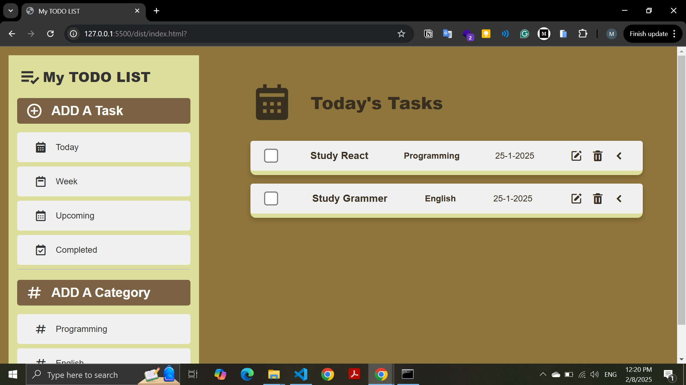

# Todo List Application - Odin

## Live Demo
[Check out the live version here!](https://mohamednaeemm.github.io/advanced-todoList-Odin)

## Project Overview
This is a simple and interactive Todo List application built using **Webpack**, **HTML**, **CSS**, and **JavaScript**. The project is part of [The Odin Project](https://www.theodinproject.com/) curriculum, focusing on practical web development skills.

## Features
- Add, edit, and delete categories
- Add and manage tasks within categories
- Real-time category and task updates
- Clear and organized user interface

## Future Improvements
- Make the application fully responsive for all screen sizes
- Implement local storage to save tasks and categories between sessions
- Update tasks to reflect the edited category names

## How to Use
1. Clone the repository.
2. Run `npm install` to install dependencies.
3. Use `npm run build` to bundle the project with Webpack.
4. Open the `dist/index.html` file in your browser to view the project.

## Technologies Used
- Webpack for module bundling
- HTML for structure
- CSS for styling
- JavaScript for dynamic functionality

---
Enjoy organizing your tasks efficiently!

